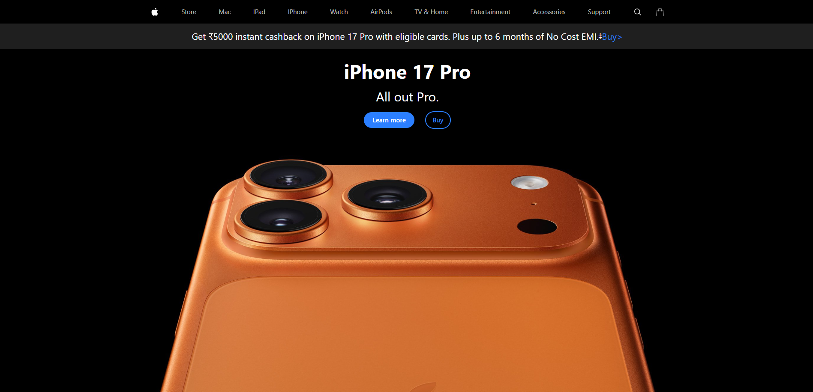

# Apple Clone Website
A responsive Apple website clone built with HTML and Tailwind CSS. It recreates Apple’s clean and modern look, with smooth scaling and consistent styling on desktops, tablets, and phones. This project was a fun way to practice front-end development, responsive design, and utility-first styling while building a sleek, real-world interface.

## Features
- Modern Apple-inspired interface  
- Fully Responsive layout  
- Utility-first styling with Tailwind CSS  
- Lightweight and scalable codebase  

## Tech Stack
- **HTML5**  
- **Tailwind CSS**

## Skills Demonstrated 
- Responsive design using Tailwind breakpoints  
- Flexible layouts with Flexbox and Grid  
- Component-driven styling for efficient development  
- Consistent spacing, typography, and component patterns  

## Technical Skills Demonstrated

### Front-End Engineering
- Mastery of semantic HTML structure for clarity and maintainability  
- Development of grid- and flexbox-based layouts to replicate real-world UI frameworks  
- Implementation of responsive typography, spacing, and component scaling for device variability  

### Tailwind CSS Expertise
- Efficient use of utility classes for spacing, colors, borders, shadows, transitions, and responsiveness  
- Integration of custom configuration (if applicable) for typography, container widths, and color palette tuning  
- Application of responsive variants (e.g., `sm:`, `md:`, `lg:`) to control behavior across breakpoints  

### UI/UX Practices
- Reproduction of Apple-like design language with balanced layout and consistent visual rhythm  
- Attention to visual hierarchy through controlled typography scaling and precise component alignment  
- Creation of scalable design patterns that support multiple content sections.